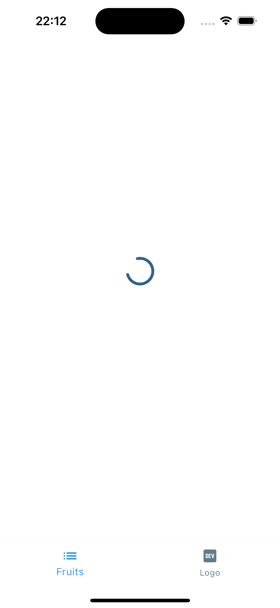
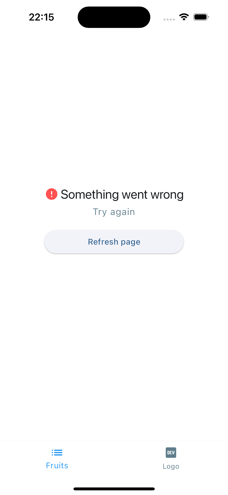
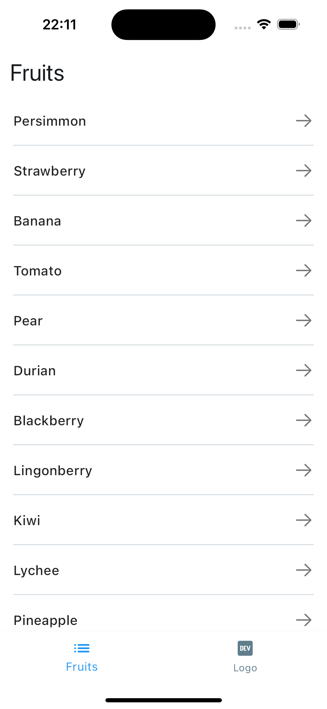
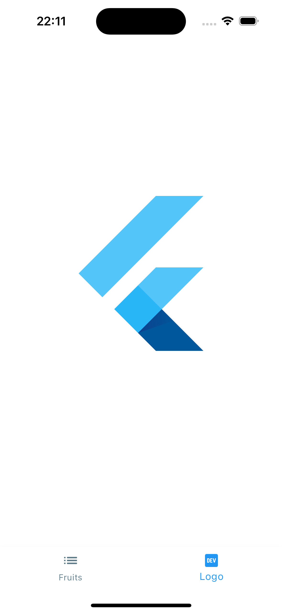

# Тестовое задание для Winfox

🦊 3 адаптивных экрана с логикой обращения к публичному API

## Инструкция по инициализации проекта

Для того чтобы инициализировать проект, выполните следующую команду в терминале:

```sh
make
```

### Скриншоты

<div display=flex flex-wrap=wrap; justify-content=space-around padding=20px>
    <div margin=10px text-align=center>
        
        <p margin-top=5px>Состояние загрузки</p>
    </div>
    <div margin=10px text-align=center>
        
        <p margin-top=5px>Состояние ошибки</p>
    </div>
    <div margin=10px text-align=center>
        
        <p margin-top=5px>Загруженный список</p>
    </div>
    <div margin=10px text-align=center>
        
        <p margin-top=5px>Страница деталей</p>
    </div>
    <div margin=10px text-align=center>
        
        <p margin-top=5px>Страница с лого</p>
    </div>
</div>


